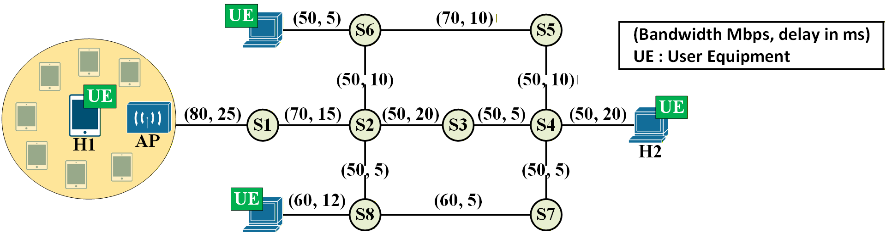

<div align="center">

## FlexNGIA 2.0: Redesigning the Internet with Agentic AI <br> Protocols, Services, and Traffic Engineering Designed, Deployed, <span style="white-space: nowrap;">and Managed</span> by AI

**Mohamed Faten Zhani**<sup>1,2</sup>, **Younes Korbi**<sup>1,2</sup> and **Yamen Mkadem**<sup>1,2</sup>  
<sup>1</sup>FlexNGIA, Tunisia 
</br><sup>2</sup>ISITCom, University of Sousse, Tunisia  
📧 {mfzhani, ykorbi, ymkadem}@FlexNGIA.net

[](https://arxiv.org/abs/2509.02124)
[](https://www.flexngia.net/)

</div>
 
<div align="center">
    
</div>

---

## 📖 Introduction

This repository contains the official implementation and experimental code for the paper:

> **"FlexNGIA 2.0: Redesigning the Internet with Agentic AI — Protocols, Services, and Traffic Engineering Designed, Deployed, and Managed by AI"**  
> M. F. Zhani, Y. Korbi and Y. Mkadem, 2025. [[arXiv:2509.02124]](https://arxiv.org/abs/2509.02124)

The Internet's core protocols — TCP congestion control, routing, and service orchestration — were designed decades ago with static, hand-tuned heuristics. As modern networks grow increasingly dynamic and heterogeneous (e.g., Wi-Fi, satellite, 5G), these rigid designs struggle to adapt. **FlexNGIA 2.0** proposes a paradigm shift: letting **Agentic AI** — autonomous LLM-powered agents — take over the design, implementation, and runtime management of network protocols and services.

The key idea is to close the loop between **network telemetry** and **protocol behavior**. Instead of human engineers manually analyzing network traces and writing new algorithms, an AI agent continuously:
1. **Observes** real-time network metrics (throughput, RTT, loss, congestion window) via custom kernel instrumentation.
2. **Reasons** about the current network state using structured, multi-step LLM reasoning.
3. **Designs** new protocol logic (e.g., congestion control algorithms) tailored to the observed conditions.
4. **Implements** the design as production-grade kernel C code.
5. **Deploys** the new module into the running Linux kernel — with zero downtime, no reboot, and no recompilation of the kernel itself.

This repository provides the complete, end-to-end implementation of this vision, covering three main pillars:

- **Custom TCP Kernel Modules** — Low-level kernel extensions that enable high-precision TCP monitoring and runtime-switchable congestion control via a proxy delegation mechanism.
- **AI-Driven Congestion Control Agent** — A LangGraph/LangChain-based autonomous agent that evaluates network performance, architects new CC strategies, generates kernel C code, and hot-swaps modules into the running kernel.
- **Mininet-WiFi Experimentation** — A reproducible wireless testbed for evaluating AI-generated CC algorithms against standard schemes under realistic conditions.

This work also builds upon foundational research on congestion control in wireless networks:

> Y. Korbi, M. F. Zhani and J. Kaippallimalil, "Congestion Control in Wi-Fi Networks — State of the Art, Performance Evaluation, and Key Research Directions," IEEE Access, vol. 12, pp. 94972–94989, 2024.  
> DOI: [10.1109/ACCESS.2024.3425271](https://doi.org/10.1109/ACCESS.2024.3425271)

---

## 📚 Table of Contents

- [📖 Introduction](#-introduction)
- [📂 Repository Structure](#-repository-structure)
- [1. Custom TCP Kernel Modules](#1-custom-tcp-kernel-modules)
  - [1.1 High-Precision TCP Monitoring](#11-high-precision-tcp-monitoring)
  - [1.2 TCP Proxy: Runtime-Switchable CC](#12-tcp-proxy-runtime-switchable-cc)
- [2. AI-Driven Congestion Control Agent](#2-ai-driven-congestion-control-agent)
  - [2.1 Agent Architecture (LangGraph)](#21-agent-architecture-langgraph)
  - [2.2 Agent Pipeline](#22-agent-pipeline)
  - [2.3 Kernel Integration & Tools](#23-kernel-integration--tools)
- [3. Network Emulation & Experiments](#3-network-emulation--experiments)
  - [3.1 Mininet-WiFi Topology](#31-mininet-wifi-topology)
  - [3.2 Metric Collection & Analysis](#32-metric-collection--analysis)
- [4. SFC & Protocol Agent](#4-sfc--protocol-agent)
- [🚀 Getting Started](#-getting-started)
- [📫 Citation](#-citation)
- [🤝 Contributing](#-contributing)
- [📧 Contact](#-contact)

---

## 📂 Repository Structure

```text
FlexNGIA-2.0/
├── README.md                          # This file — project overview
├── TCP/                               # Custom TCP kernel modules
│   └── README.md                      # Detailed kernel modification guide
├── congestion-control-agent/          # AI-driven CC agent
│   ├── README.md                      # Agent architecture & usage guide
│   ├── agent/                         # LangGraph agent core
│   │   ├── main.py                    # Agent entrypoint
│   │   ├── schemas.py                 # Structured outputs & graph state
│   │   ├── tools/                     # Compiler, metrics, CC reader tools
│   │   ├── traces/                    # LLM reasoning logs
│   │   └── workspace/                 # Build area (.c files, .ko modules)
│   ├── mininet/                       # Network emulation
│   │   ├── topo.py                    # WiFi topology definition
│   │   ├── h1-client.py              # Traffic generator
│   │   └── h2-server.py              # Traffic sink
│   ├── results/                       # Raw experiment data (CSV)
│   ├── analysis/                      # Visualization scripts & plots
│   ├── helpers/                       # Background daemons (metrics)
│   └── run_test.sh                    # Master orchestration script
└── resources/                         # Shared assets (logo, diagrams, paper)
```

---

## 1. Custom TCP Kernel Modules

To support AI-driven congestion control, the Linux kernel is extended with two custom modules. These modifications provide the **observability** and **controllability** that the AI agent needs to operate.

👉 Full implementation details, code listings, and installation instructions: [`TCP/README.md`](./TCP/README.md)

### 1.1 High-Precision TCP Monitoring

Standard user-space tools (`ss`, `netstat`) poll at fixed intervals and miss transient TCP events that occur on millisecond timescales. We solve this by instrumenting the kernel's TCP stack directly:

- **Modified `tcp_sock` structure** — Two new fields appended: `sending_rate_mbps` (real-time throughput) and `is_monitored` (selective tracing flag).
- **Custom `setsockopt` option (150)** — Allows user-space applications to toggle per-socket monitoring on/off.
- **Custom tracepoint (`tcp_monitor_log`)** — A zero-overhead ftrace event that fires on every ACK, capturing CWND, RTT, sending rate, and connection identity with microsecond precision.
- **Strategic hook placement** — The tracepoint is installed at the end of `tcp_ack()`, after `tcp_rate_gen()` and `tcp_cong_control()`, ensuring it captures the final, post-processing state.

### 1.2 TCP Proxy: Runtime-Switchable CC

A lightweight kernel module (`proxy`) that registers as a standard CC algorithm but delegates all congestion logic to another algorithm chosen at runtime:

- **Delegation model** — Forwards `ssthresh()`, `cong_avoid()`, and `undo_cwnd()` callbacks to a configurable delegate (default: `reno`).
- **Runtime switching** — The delegate is controlled via `/sys/module/tcp_proxy/parameters/delegate_cc` — no reboot or recompilation required.
- **Transparent to the kernel** — The system sees `proxy` as the active CC; the delegation is entirely internal.
- **Enables AI hot-swapping** — The agent compiles a new CC module, loads it with `insmod`, and switches the proxy's delegate in a single command.

---

## 2. AI-Driven Congestion Control Agent

The core of FlexNGIA 2.0: an autonomous LLM-powered agent that closes the loop between network telemetry and transport-layer control.

👉 Full architecture, schemas, tools, and usage: [`congestion-control-agent/README.md`](./congestion-control-agent/README.md)

### 2.1 Agent Architecture (LangGraph)

The agent is built on [LangGraph](https://langchain-ai.github.io/langgraph/) (part of the LangChain ecosystem), which provides:

- **Graph-based workflow** — Nodes (Python functions, LLM calls, tool invocations) connected by directed edges with conditional routing.
- **Shared state (`AgentState`)** — A typed dictionary passed between nodes, carrying metrics, diagnostics, generated code, and compiler output.
- **Native tool integration** — Kernel compilation, module loading, metrics collection, and CC reading are exposed as callable tools.
- **Self-correction loops** — On compile or load failure, the graph routes back to the Coder node with error logs for automated fixing.
- **Observability** — Full tracing via LangSmith for real-time monitoring of LLM prompts, tool calls, and state transitions.

### 2.2 Agent Pipeline

The agent operates in a four-stage pipeline, each implemented as a LangGraph node:

| Stage | Node | Role |
|-------|------|------|
| 1 | **Evaluator** | Analyzes current CC performance and network metrics; identifies bottlenecks (bandwidth-limited, latency-limited, loss-limited) via multi-step reasoning. |
| 2 | **Architect** | Translates the diagnosis into a mathematical CC design — specifying `ssthresh`, `cong_avoid`, and `undo_cwnd` logic with safety constraints. |
| 3 | **Coder** | Converts the architect's blueprint into valid Linux kernel C code using a strict kernel module skeleton; self-corrects on errors. |
| 4 | **Compiler** | Builds the `.ko` module, unloads the previous CC, loads the new one via `insmod`, and switches the proxy delegate. |

Each node produces **structured output** (typed Python objects) — no ad-hoc parsing of free-form LLM text.

### 2.3 Kernel Integration & Tools

The agent interacts with the Linux kernel through a set of purpose-built tools:

- **Compiler tool** ([`agent/tools/compiler.py`](./congestion-control-agent/agent/tools/compiler.py)) — Wraps `make`, `insmod`, `rmmod`; builds modules in the workspace directory.
- **CC reader** ([`agent/tools/get_current_cc.py`](./congestion-control-agent/agent/tools/get_current_cc.py)) — Reads the active CC algorithm from `/proc/sys/net/ipv4/tcp_congestion_control`.
- **Metrics aggregator** ([`agent/tools/get_metrics_summary.py`](./congestion-control-agent/agent/tools/get_metrics_summary.py)) — Collects live network telemetry (throughput, RTT, CWND, losses) and feeds it into the agent's state.
- **Trace logger** ([`agent/tools/trace_logger.py`](./congestion-control-agent/agent/tools/trace_logger.py)) — Records each node's inputs, outputs, and LLM reasoning for post-mortem analysis.

---

## 3. Network Emulation & Experiments

All experiments are conducted in **Mininet-WiFi**, providing a reproducible wireless testbed.

### 3.1 Mininet-WiFi Topology

The network topology ([`mininet/topo.py`](./congestion-control-agent/mininet/topo.py)) simulates a wireless scenario:

- **H1 (Client)** — Generates traffic using `iperf3`
- **H2 (Server)** — Receives traffic
- **AP1 (Access Point)** — Configurable bandwidth limits and delay to emulate diverse link conditions (e.g., lossy Wi-Fi, satellite)

<div align="center">



</div>

### 3.2 Metric Collection & Analysis

- **Real-time collection** — Kernel-level TCP statistics are captured via the custom tracepoint and saved to `results/{session_id}.csv`.
- **Visualization** — [`analysis/plot_results.py`](./congestion-control-agent/analysis/plot_results.py) generates performance dashboards from the raw CSV data.
- **Full automation** — [`run_test.sh`](./congestion-control-agent/run_test.sh) orchestrates the entire pipeline: topology startup → agent execution → data collection → plot generation.

---

## 4. SFC & Protocol Agent

*(Coming soon)* This section will cover the AI-Driven SFC & Protocol Agent:

- Agent architecture and prompt design
- Dynamic SFC and protocol generation
- Custom header design and UDP-based protocol implementation
- Network Function Catalog and custom NF code generation
- Mininet-WiFi topology and experiment scripts
- Performance comparison with TCP and UDP

---

## 🚀 Getting Started

### Prerequisites

- Ubuntu 20.04+ (Kernel 5.15+ recommended)
- Mininet-WiFi
- Python 3.10+
- Root privileges (for kernel modules and Mininet)
- API key for an LLM provider (e.g., OpenAI / Groq) stored in `.env`

**Highly Recommended:** Download the Mininet-WiFi VM image with Mininet-WiFi and Python pre-installed:  
[`Download Link`](https://drive.google.com/file/d/1R8n4thPwV2krFa6WNP0Eh05ZHZEdhw4W/view)  
Login: `wifi` / Password: `wifi`

### Installation

```bash
# Clone the repository
git clone https://github.com/Youneskr/FlexNGIA-2.0.git
cd FlexNGIA-2.0

# Install system dependencies
sudo apt update
sudo apt install -y build-essential git openvswitch-switch python3-pip

# Install Python dependencies
pip install -r congestion-control-agent/requirements.txt
```

### Quick Start

```bash
# Run the full automated experiment
cd congestion-control-agent
sudo ./run_test.sh
```

This will start the Mininet-WiFi topology, launch the AI agent, run an end-to-end experiment, and generate results and plots.

For manual execution or advanced configuration, see the detailed guides:
- Kernel setup: [`TCP/README.md`](./TCP/README.md)
- Agent usage: [`congestion-control-agent/README.md`](./congestion-control-agent/README.md)

---

## 📫 Citation

If you use this code or refer to this work, please cite the following papers:

```bibtex
@misc{zhani2025flexngia20redesigninginternet,
      title={FlexNGIA 2.0: Redesigning the Internet with Agentic AI -- Protocols, Services, and Traffic Engineering Designed, Deployed, and Managed by AI}, 
      author={Mohamed Faten Zhani and Younes Korbi and Yamen Mkadem},
      year={2025},
      eprint={2509.02124},
      archivePrefix={arXiv},
      primaryClass={cs.NI},
      url={https://arxiv.org/abs/2509.02124}, 
}
```

```bibtex
@ARTICLE{10589468,
  author={Korbi, Younes and Zhani, Mohamed Faten and Kaippallimalil, John},
  journal={IEEE Access}, 
  title={Congestion Control in Wi-Fi Networks — State of the Art, Performance Evaluation, and Key Research Directions}, 
  year={2024},
  volume={12},
  pages={94972-94989},
  doi={10.1109/ACCESS.2024.3425271}
}
```

---

## 🤝 Contributing

Contributions are welcome! Please open an issue or submit a pull request for any improvements or bug fixes.

---

## 📧 Contact

For questions or collaborations, please contact:  
[mfzhani@flexNGIA.net](mailto:mfzhani@flexNGIA.net)  
Website: [flexngia.net](https://www.flexngia.net/)