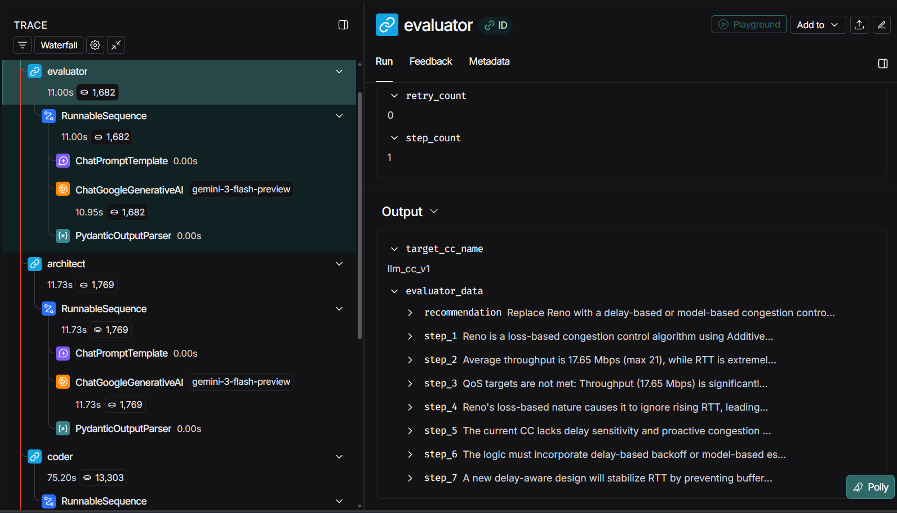

# AI-Driven Congestion Control Agent

<div align="center">

[](https://langchain-ai.github.io/langgraph/)
[](https://github.com/intrig-unicamp/mininet-wifi)
[](https://www.kernel.org/)
[](https://www.python.org/)

</div>

---

## Overview

At FlexNGIA 2.0, we engineer autonomous, production-grade systems that close the loop between network telemetry and transport-layer control. This repository delivers a fully autonomous framework for designing, implementing, and deploying TCP Congestion Control (CC) algorithms directly into the Linux kernel.

Our CC agent:
- Evaluates the current CC performance and overall network behavior
- Designs a new CC strategy to meet a target QoS profile (throughput/latency)
- Implements the strategy as valid kernel C code
- Compiles and hot‑swaps the module into the running kernel—no reboot required

All of this is orchestrated by an LLM-powered agent built on LangGraph (part of the LangChain ecosystem) for robust control flow, state, tooling, and observability.

---

## Directory Structure

```text
.
├── agent/                  # The AI Brain (LangGraph / LangChain)
│   ├── main.py             # Agent entrypoint
│   ├── schemas.py          # Structured outputs & graph state
│   ├── tools/              # System Interaction Tools (Make, Insmod, Logs, Metrics)
│   ├── traces/             # LLM reasoning logs (step-by-step decisions)
│   └── workspace/          # Build area (.c files, .ko modules)
├── mininet/                # Network emulation
│   ├── topo.py             # WiFi topology definition
│   ├── h1-client.py        # Traffic generator
│   └── h2-server.py        # Traffic sink
├── results/                # Raw experiment data (CSV)
├── analysis/               # Visualization scripts
├── helpers/                # Background daemons (metrics collection, etc.)
└── run_test.sh             # Master orchestration script
```

Key files (quick links):
- Agent entrypoint: [agent/main.py](agent/main.py)
- Graph definition: [agent/graph_brain.py](agent/graph_brain.py)
- State & schemas: [agent/schemas.py](agent/schemas.py)
- Tooling:
  - Compiler/load: [agent/tools/compiler.py](agent/tools/compiler.py)
  - Active CC reader: [agent/tools/get_current_cc.py](agent/tools/get_current_cc.py)
  - Metrics aggregator: [agent/tools/get_metrics_summary.py](agent/tools/get_metrics_summary.py)
- Emulation:
  - Topology: [mininet/topo.py](mininet/topo.py)
  - Client: [mininet/h1-client.py](mininet/h1-client.py)
  - Server: [mininet/h2-server.py](mininet/h2-server.py)
- Analysis: [analysis/plot_results.py](analysis/plot_results.py)
- Orchestration: [run_test.sh](run_test.sh)

---

## Table of Contents

- [1. LangChain / LangGraph Agent Architecture](#1-langchain--langgraph-agent-architecture)
  - [1.1 Why LangGraph?](#11-why-langgraph)
  - [1.2 Graph Model: Nodes, Edges, Workflow](#12-graph-model-nodes-edges-workflow)
  - [1.3 Graph State (Shared Memory)](#13-graph-state-shared-memory)
  - [1.4 Tools Integration](#14-tools-integration)
  - [1.5 Structured Output (Schemas)](#15-structured-output-schemas)
  - [1.6 Agent Nodes](#16-agent-nodes)
  - [1.7 Graph Visualization](#17-graph-visualization)
  - [1.8 Run the Agent](#18-run-the-agent)
  - [1.9 LangSmith for Debugging and Monitoring](#19-langsmith-for-debugging-and-monitoring)
- [2. Network Emulation & Metrics](#2-network-emulation--metrics)
  - [2.1 Mininet-WiFi Topology](#21-mininet-wifi-topology)
  - [2.2 Metric Collection (helpers/)](#22-metric-collection-helpers)
  - [2.3 Analysis & Visualization (analysis/)](#23-analysis--visualization-analysis)
  - [2.4 Automation (run_testsh)](#24-automation-run_testsh)
- [3. Getting Started](#3-getting-started)
  - [3.1 Prerequisites](#31-prerequisites)
  - [3.2 Installation](#32-installation)
- [4. How to Execute the Agent](#4-how-to-execute-the-agent)
  - [4.1 Full Automated Test](#41-full-automated-test)
  - [4.2 Manual Execution](#42-manual-execution)
- [5. Summary](#5-summary)

---

## 1. LangChain / LangGraph Agent Architecture

### 1.1 Why LangGraph?

LangGraph is a Python framework for building agentic and multi-agent applications where an LLM controls application flow. We use it to deliver a graph-based AI system that:
- Automates the full pipeline: evaluation → design → coding → compilation
- Provides first-class state management, tooling, routing, retry, and debugging

This replaces brittle, one-off control flow with a proven, observable, and extensible architecture.

---

### 1.2 Graph Model: Nodes, Edges, Workflow

The agent is modeled as a graph:
- Nodes: atomic units of work (Python functions, LLM calls, tool invocations)
- Edges: directed connections encoding workflow and routing
- Graph: orchestrates sequencing, branching, retries, and loops

In our pipeline, each stage is a node. Nodes can be:
- Pure Python functions
- LLM-powered components using LangChain primitives
- Hybrids that call tools and shell commands

Workflow and routing:
- Example: Evaluator → Architect → Coder → Compiler
- Conditional control: on compile error, route back to Coder
- This enables cyclic, self-correcting workflows with clear state boundaries

---

### 1.3 Graph State (Shared Memory)

Each node:
1) Receives the current shared state, 2) reads what it needs, 3) writes its outputs, 4) returns an updated state.

The state is defined in [agent/schemas.py](agent/schemas.py):

```python
class AgentState(TypedDict):
    """The memory passed between nodes"""
    session_id: str
    step_count: int
    metrics: dict
    current_cc: str
    target_cc_name: str
    
    # 7-step analysis
    evaluator_data: Optional[EvaluatorOutput]
    architect_data: Optional[ArchitectOutput]
    
    # Execution
    c_code: str
    compiler_output: str
    error: bool
    retry_count: int
```

Field explanations:
- `session_id`: Unique ID for the current experiment run; used for filenames, logs, and results.
- `step_count`: Number of steps (node transitions) taken so far; useful for debugging and safety limits.
- `metrics`: Latest network telemetry (throughput, RTT, cwnd, retransmissions, etc.).
- `current_cc`: Name of the currently active kernel CC algorithm (e.g., `cubic`, `bbr`, `llm_cc_v1`).
- `target_cc_name`: Name the agent intends to give to the new CC algorithm/module.
- `evaluator_data` (EvaluatorOutput): Structured diagnostic output from the Evaluator node (bottleneck type, narrative, summaries).
- `architect_data` (ArchitectOutput): Structured blueprint from the Architect node (formulas, control logic).
- `c_code`: Latest C implementation generated by the Coder node.
- `compiler_output`: Build + kernel tooling logs (stdout/stderr from `make`, `insmod`, `rmmod`).
- `error`: Flag indicating whether the last operation (usually compilation or module load) failed.
- `retry_count`: Number of times the agent has attempted to fix and recompile the module.

---

### 1.4 Tools Integration

LangGraph/LangChain expose tools as standard Python callables that the agent can invoke.

Our tools (see [agent/tools/](agent/tools/)):
- [agent/tools/compiler.py](agent/tools/compiler.py)
  - Wraps `make`, `insmod`, and `rmmod`
  - Builds `.ko` modules in [agent/workspace/](agent/workspace/)
  - Loads/unloads the CC kernel module and updates `current_cc`
- [agent/tools/get_current_cc.py](agent/tools/get_current_cc.py)
  - Reads the active congestion control algorithm from `/proc` / `/sys`
- [agent/tools/get_metrics_summary.py](agent/tools/get_metrics_summary.py)
  - Collects live network metrics for the agent’s decisions
- Trace logging (stored under [agent/traces/](agent/traces/))
  - Each `session_id` gets its own file set for post-mortem analysis

These tools are invoked from inside graph nodes to keep decisions data-driven and observable.

---

### 1.5 Structured Output (Schemas)

Naively parsing free-form LLM outputs is brittle. We enforce structure:
- Define schemas with typed Python (TypedDict, pydantic, etc.)
- Prompt the LLM to strictly follow those schemas
- Validate and parse outputs automatically

In [agent/schemas.py](agent/schemas.py):
- `EvaluatorOutput`: `diagnosis_steps`, `bottleneck_type`, `qos_gaps`, etc.
- `ArchitectOutput`: `high_level_strategy`, `ssthresh_logic`, `cong_avoid_logic`, etc.
- Similar patterns can be applied to `Coder` and `Compiler` outputs
- Each node returns a type-safe Python object that is persisted in `AgentState`

This guarantees well-formed data across the pipeline—no ad-hoc parsers.

---

### 1.6 Agent Nodes

The CC agent’s core logic is split into four primary LangGraph nodes, plus logging.

#### 1) Evaluator Node
- Role
  - Analyzes current network performance and CC behavior
  - Identifies bottlenecks and explains them in a multi-step reasoning chain
- Input (from state)
  - `metrics`, `current_cc`, `session_id`, `step_count`
- Structured output (EvaluatorOutput)
  - `diagnosis_steps`, `bottleneck_type` (e.g., "bandwidth_limited" / "latency_limited" / "loss_limited"), `qos_summary`, `recommendations`
- State modifications
  - Writes `evaluator_data`
  - Increments `step_count`

---

#### 2) Architect Node
- Role
  - Translates the evaluator’s diagnosis into a mathematical design for a new CC algorithm
  - Specifies how `ssthresh`, `cong_avoid`, `undo_cwnd`, etc. should behave
- Input (from state)
  - `evaluator_data`, `metrics`, `current_cc`, `target_cc_name` (may initialize or update)
- Structured output (ArchitectOutput)
  - `high_level_strategy`, `ssthresh_logic`, `cong_avoid_logic`, `undo_cwnd_logic`, `safety_constraints`
- State modifications
  - Writes `architect_data`
  - Sets or refines `target_cc_name` (e.g., `llm_cc_v1`)
  - Increments `step_count`

---

#### 3) Coder Node
- Role
  - Converts the architect’s design into valid Linux kernel C code
  - Uses a strict kernel skeleton to ensure ABI compatibility and safety
  - Performs self-correction: on compile errors, reads logs and fixes the code
- Input (from state)
  - `architect_data`, `target_cc_name`, previous `c_code` (if retrying), `compiler_output` (if previous build failed), `retry_count`
- Structured output (e.g., CoderOutput)
  - `c_code` (full `.c` source code), `comments` (major design decisions), `applied_fixes` (on retries)
- State modifications
  - Writes `c_code`
  - Clears or updates `error` (typically reset before compilation)
  - Increments `step_count`

---

#### 4) Compiler Node
- Role
  - System integrator: builds and deploys the generated C code as a kernel module
  - Coordinates with [agent/tools/compiler.py](agent/tools/compiler.py) and other tools
- Input (from state)
  - `c_code`, `target_cc_name`, `session_id`, `retry_count`
- Structured output (e.g., CompilerOutput)
  - `compiler_output` (logs from `make`, `insmod`, `rmmod`), `success` (bool), `activated_cc_name`
- State modifications
  - Writes `compiler_output`
  - Updates `current_cc`
  - Sets `error` (true if build or `insmod` failed, false otherwise)
  - Increments `retry_count` on failure
  - Increments `step_count`
  - If `error` is true, workflow routes back to Coder for self-correction

---

#### 5) Logger / Tracing
- Logger role
  - Records each node’s inputs, outputs, prompts, and tool calls
  - Writes chronological traces for post-mortem analysis
- Implementation
  - Traces written to [agent/traces/](agent/traces/)
  - Each `session_id` gets its own trace directory or file set

---

### 1.7 Graph Visualization

<div align="center">


</div>

---

### 1.8 Run the Agent

Install dependencies and start the agent (root privileges required for kernel interactions):

```bash
pip install -r requirements.txt
```

```bash
sudo python3 agent/main.py
```

The agent listens for new experiments by monitoring the `results` folder. Once a new session is created, it will start the workflow, generate the congestion control module, compile it, and load it into the kernel. Monitor progress in real time via detailed logs in [agent/traces/](agent/traces/).

---

### 1.9 LangSmith for Debugging and Monitoring

LangSmith provides end-to-end tracing and evaluation for LangChain apps.

In this project, you can:
- Enable tracing to see the graph execute in real time
- Inspect node-level inputs/outputs, LLM prompts and responses, tool calls, latency, and errors

Basic setup (if you have a LangSmith account):

```bash
export LANGCHAIN_TRACING_V2="true"
export LANGCHAIN_ENDPOINT="https://api.smith.langchain.com"
export LANGCHAIN_API_KEY="YOUR_LANGSMITH_KEY"
export LANGCHAIN_PROJECT="flexngia-cc-agent"
```

Then run the agent and inspect traces in the LangSmith UI.

<div align="center">



</div>

---

## 2. Network Emulation & Metrics

### 2.1 Mininet-WiFi Topology

The network is defined in [mininet/topo.py](mininet/topo.py). It simulates a wireless scenario:
- H1 (Client): Generates traffic using `iperf3`
- H2 (Server): Receives traffic
- AP1 (Access Point): Limits bandwidth and adds delay (e.g., satellite or unstable links)

Topology:

<div align="center">


</div>

---

### 2.2 Metric Collection (helpers/)

To monitor CC performance, kernel-level TCP statistics are collected in real time:
- Daemon: metrics are collected via [agent/tools/get_metrics_summary.py](agent/tools/get_metrics_summary.py)
- Storage: Data is saved to `results/{session_id}.csv`

These metrics are fed back into the LangGraph state as `metrics`, closing the loop between environment and agent.

---

### 2.3 Analysis & Visualization (analysis/)

Use [analysis/plot_results.py](analysis/plot_results.py) to convert raw CSV logs into visual dashboards.

---

### 2.4 Automation (run_test.sh)

[run_test.sh](run_test.sh) automates the full AI-driven loop:
- Cleans previous kernel modules (`rmmod`)
- Starts Mininet-WiFi topology
- Launches the LangGraph-based CC agent
- Waits for completion and generates plots

---

## 3. Getting Started

### 3.1 Prerequisites

- Ubuntu 20.04 / 22.04 (Kernel 5.15+ recommended)
- Root privileges (for Mininet and kernel modules)
- Python 3.10+
- API key for an LLM provider (e.g., OpenAI / Groq) stored in `.env`
- Optional: LangSmith account for advanced tracing

---

### 3.2 Installation

```bash
# 1) System dependencies
sudo apt update
sudo apt install -y build-essential git openvswitch-switch python3-pip

# 2) Python dependencies
pip install -r agent/requirements.txt
```

---

## 4. How to Execute the Agent

You can either run the full automated pipeline or start components manually.

### 4.1 Full Automated Test

```bash
sudo ./run_test.sh
```

This will:
1. Start Mininet-WiFi topology
2. Launch the LangGraph-based CC agent ([agent/main.py](agent/main.py))
3. Run an end-to-end experiment
4. Save:
   - Metrics to `results/{session_id}.csv`
   - Agent traces to [agent/traces/](agent/traces/)
   - Generated CC C code to [agent/workspace/](agent/workspace/)
   - Plots to [analysis/](analysis/) (or `results/` depending on configuration)

---

### 4.2 Manual Execution

In separate terminals:

```bash
# Terminal 1: Start network topology
cd mininet
sudo python3 topo.py
```

```bash
# Terminal 2: Start the LangGraph CC agent
cd agent
sudo python3 main.py
```

Optional: export the LangSmith variables (see [1.9](#19-langsmith-for-debugging-and-monitoring)) to monitor the graph execution in real time.

---

## 5. Summary

- The CC agent is a LangGraph / LangChain-based autonomous system that:
  - Evaluates current CC and network performance
  - Designs new CC logic
  - Implements it in C
  - Compiles and hot-swaps it into the Linux kernel
- LangGraph provides:
  - A graph abstraction (nodes, edges) for complex workflows
  - A shared state (`AgentState`) for coordination
  - Native support for tools and structured outputs
- LangSmith enables deep tracing to inspect, monitor, and debug the entire workflow in real time.

---

## 🤝 Contributing

Contributions are welcome! Please open an issue or submit a pull request for any improvements or bug fixes.

---

## 📧 Contact

For questions or collaborations, please contact:  
[mfzhani@flexNGIA.net](mailto:mfzhani@flexNGIA.net)  
Website: [www.FlexNGIA.net](https://www.flexngia.net/)